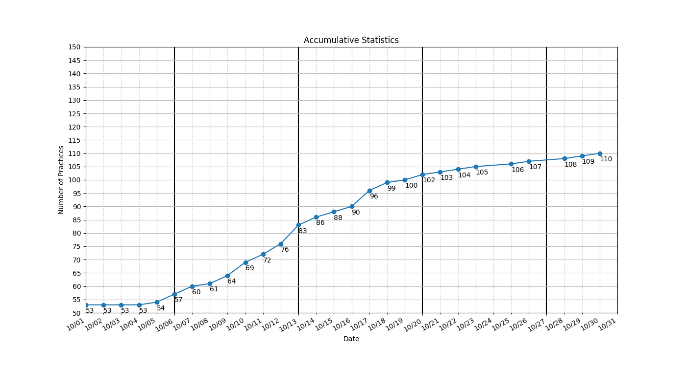

```
algo
├── _0005_LongestPalindromicSubstring.py
├── _0125_ValidPalindrome.py
├── _0409_LongestPalindrome.py
├── array
│   ├── _0001_TwoSum.py
│   ├── _0167_TwoSum2-InputArrayIsSorted.py
│   ├── _0169_MajorityElement.py
│   ├── _0189_RotateArray.py
│   └── _0561_ArrayPartition1.py
├── bfs
│   ├── _0102_BinaryTreeLevelOrderTraversal.py
│   ├── _0107_BinaryTreeLevelOrderTraversal2.py
│   └── _0133_CloneGraph.py
├── binary-search
│   ├── _0033_SearchInRotatedSortedArray.py
│   ├── _0034_FindFirstAndLastPositionOfElementInSortedArray.py
│   ├── _0035_SearchInsertPosition.py
│   ├── _0069_Sqrt.py
│   ├── _0074_SearchA2DMatrix.py
│   ├── _0081_SearchInRotatedSortedArray2.py
│   ├── _0153_FindMinimumInRotatedSortedArray.py
│   ├── _0162_FindPeakElement.py
│   ├── _0222_CountCompleteTreeNodes.py
│   ├── _0240_SearchA2DMatrix2.py
│   ├── _0278_FirstBadVersion.py
│   ├── _0300_LongestIncreasingSubsequence.py
│   ├── _0354_RussianDollEnvelopes.py
│   ├── _0658_FindKClosestElements.py
│   └── _0704_BinarySearch.py
├── dfs
│   ├── _0017_LetterCombinationsOfAPhoneNumber.py
│   ├── _0022_GenerateParentheses.py
│   ├── _0037_SudokuSolver.py
│   ├── _0039_CombinationSum.py
│   ├── _0046_Permutations.py
│   ├── _0047_Permutations2.py
│   ├── _0051_N-Queens.py
│   ├── _0077_Combinations.py
│   ├── _0078_Subsets.py
│   ├── _0089_GrayCode.py
│   ├── _0200_NumberOfIslands.py
│   ├── _0784_LetterCasePermutation.py
│   └── _1079_LetterTilePossibilities.py
├── dp
├── hashmap
│   ├── _0049_GroupAnagrams.py
│   ├── _0146_LRUCache.py
│   ├── _0242_ValidAnagram.py
│   ├── _0380_InsertDeleteGetRandomO(1).py
│   └── _0705_DesignHashSet.py
├── heap
│   ├── _0215_KthLargestElementInAnArray.py
│   └── _1046_LastStoneWeight.py
├── linkedlist
│   ├── _0021_MergeTwoSortedLists.py
│   ├── _0024_SwapNodesInPairs.py
│   ├── _0061_RotateList.py
│   ├── _0203_RemoveLinkedListElements.py
│   └── _0206_ReverseLinkedList.py
├── recursion
│   ├── _0050_Pow(x,n).py
│   ├── _0070_ClimbingStairs.py
│   ├── _0118_PascalsTriangle.py
│   ├── _0119_PascalsTriangle2.py
│   ├── _0344_ReverseString.py
│   ├── _0509_FibonacciNumber.py
│   └── _0700_SearchInABinarySearchTree.py
├── sorting
│   └── _0912_SortAnArray.py
├── stack-queue
│   ├── _0225_ImplementStackUsingQueues.py
│   └── _0232_ImplementQueueUsingStacks.py
├── tree
│   ├── _0094_BinaryTreeInorderTraversal.py
│   ├── _0098_ValidateBinarySearchTree.py
│   ├── _0100_SameTree.py
│   ├── _0101_SymmetricTree.py
│   ├── _0104_MaximumDepthOfBinaryTree.py
│   ├── _0110_BalancedBinaryTree.py
│   ├── _0111_MinimumDepthOfBinaryTree.py
│   ├── _0112_PathSum.py
│   ├── _0113_PathSum2.py
│   ├── _0144_BinaryTreePreorderTraversal.py
│   ├── _0226_InvertBinaryTree.py
│   ├── _0230_KthSmallestElementInBST.py
│   ├── _0257_BinaryTreePaths.py
│   ├── _0429_N-aryTreeLevelOrderTraversal.py
│   ├── _0572_SubtreeOfAnotherTree.py
│   ├── _0617_MergeTwoBinaryTrees.py
│   ├── _0654_MaximumBinaryTree.py
│   └── _0701_InsertIntoABinarySearchTree.py
├── two-pointer
│   ├── _0209_MinimumSizeSubarraySum.py
│   ├── _0392_IsSubsequence.py
│   └── _0977_SquaresOfASortedArray.py
├── warmup
│   └── fibonacci.py
└── wip
    ├── _0127_WordLadder.py
    └── wordladder.py

15 directories, 85 files
=====================================
_0001_TwoSum.py
_0005_LongestPalindromicSubstring.py
_0017_LetterCombinationsOfAPhoneNumber.py
_0021_MergeTwoSortedLists.py
_0022_GenerateParentheses.py
_0024_SwapNodesInPairs.py
_0033_SearchInRotatedSortedArray.py
_0034_FindFirstAndLastPositionOfElementInSortedArray.py
_0035_SearchInsertPosition.py
_0037_SudokuSolver.py
_0039_CombinationSum.py
_0046_Permutations.py
_0047_Permutations2.py
_0049_GroupAnagrams.py
_0050_Pow(x,n).py
_0051_N-Queens.py
_0061_RotateList.py
_0069_Sqrt.py
_0070_ClimbingStairs.py
_0074_SearchA2DMatrix.py
_0077_Combinations.py
_0078_Subsets.py
_0081_SearchInRotatedSortedArray2.py
_0089_GrayCode.py
_0094_BinaryTreeInorderTraversal.py
_0098_ValidateBinarySearchTree.py
_0100_SameTree.py
_0101_SymmetricTree.py
_0102_BinaryTreeLevelOrderTraversal.py
_0104_MaximumDepthOfBinaryTree.py
_0107_BinaryTreeLevelOrderTraversal2.py
_0110_BalancedBinaryTree.py
_0111_MinimumDepthOfBinaryTree.py
_0112_PathSum.py
_0113_PathSum2.py
_0118_PascalsTriangle.py
_0119_PascalsTriangle2.py
_0125_ValidPalindrome.py
_0127_WordLadder.py
_0133_CloneGraph.py
_0144_BinaryTreePreorderTraversal.py
_0146_LRUCache.py
_0153_FindMinimumInRotatedSortedArray.py
_0162_FindPeakElement.py
_0167_TwoSum2-InputArrayIsSorted.py
_0169_MajorityElement.py
_0189_RotateArray.py
_0200_NumberOfIslands.py
_0203_RemoveLinkedListElements.py
_0206_ReverseLinkedList.py
_0209_MinimumSizeSubarraySum.py
_0215_KthLargestElementInAnArray.py
_0222_CountCompleteTreeNodes.py
_0225_ImplementStackUsingQueues.py
_0226_InvertBinaryTree.py
_0230_KthSmallestElementInBST.py
_0232_ImplementQueueUsingStacks.py
_0240_SearchA2DMatrix2.py
_0242_ValidAnagram.py
_0257_BinaryTreePaths.py
_0278_FirstBadVersion.py
_0300_LongestIncreasingSubsequence.py
_0344_ReverseString.py
_0354_RussianDollEnvelopes.py
_0380_InsertDeleteGetRandomO(1).py
_0392_IsSubsequence.py
_0409_LongestPalindrome.py
_0429_N-aryTreeLevelOrderTraversal.py
_0509_FibonacciNumber.py
_0561_ArrayPartition1.py
_0572_SubtreeOfAnotherTree.py
_0617_MergeTwoBinaryTrees.py
_0654_MaximumBinaryTree.py
_0658_FindKClosestElements.py
_0700_SearchInABinarySearchTree.py
_0701_InsertIntoABinarySearchTree.py
_0704_BinarySearch.py
_0705_DesignHashSet.py
_0784_LetterCasePermutation.py
_0912_SortAnArray.py
_0977_SquaresOfASortedArray.py
_1046_LastStoneWeight.py
_1079_LetterTilePossibilities.py
=====================================
Num of Python Practice:  83
```

