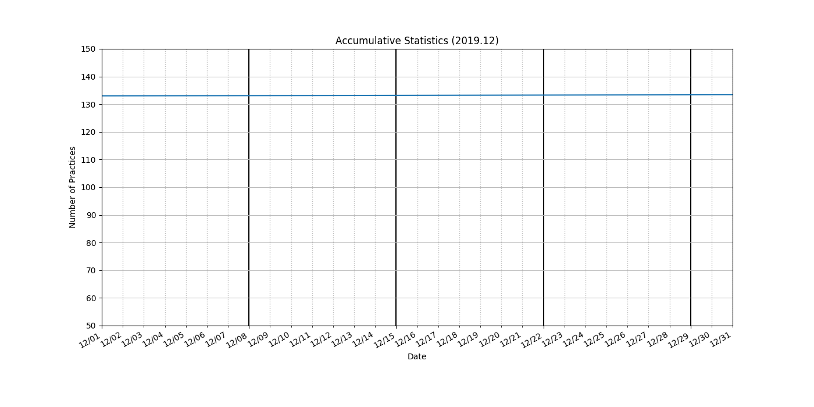
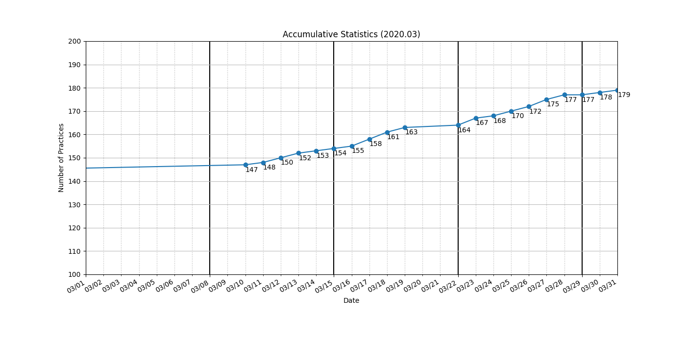
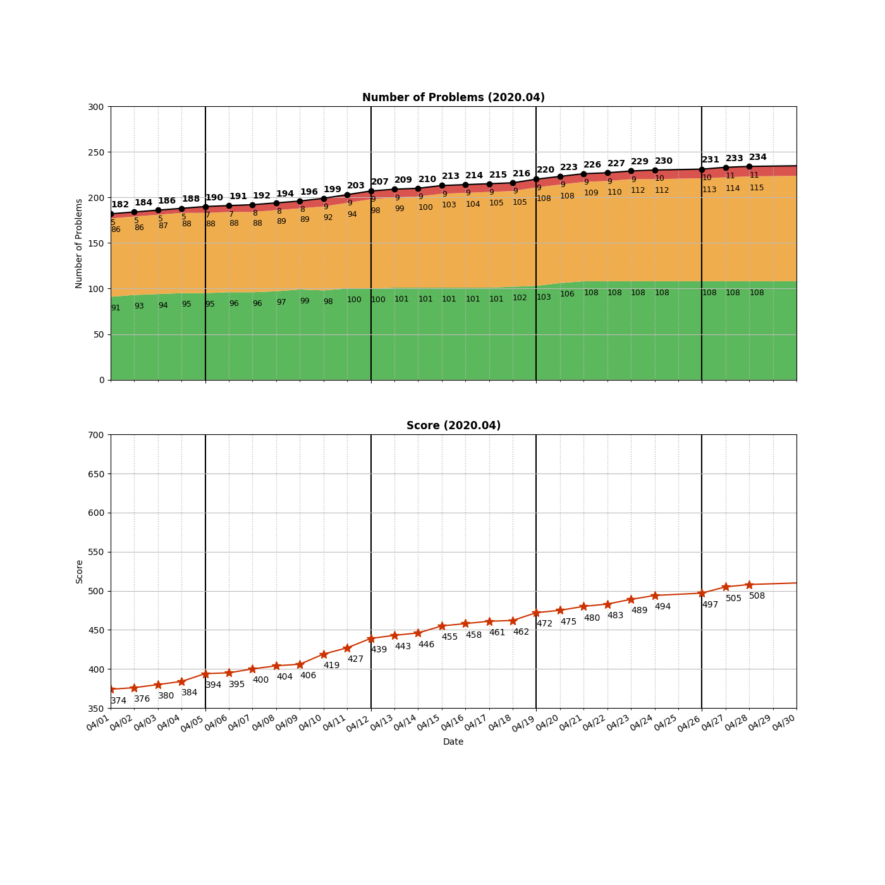
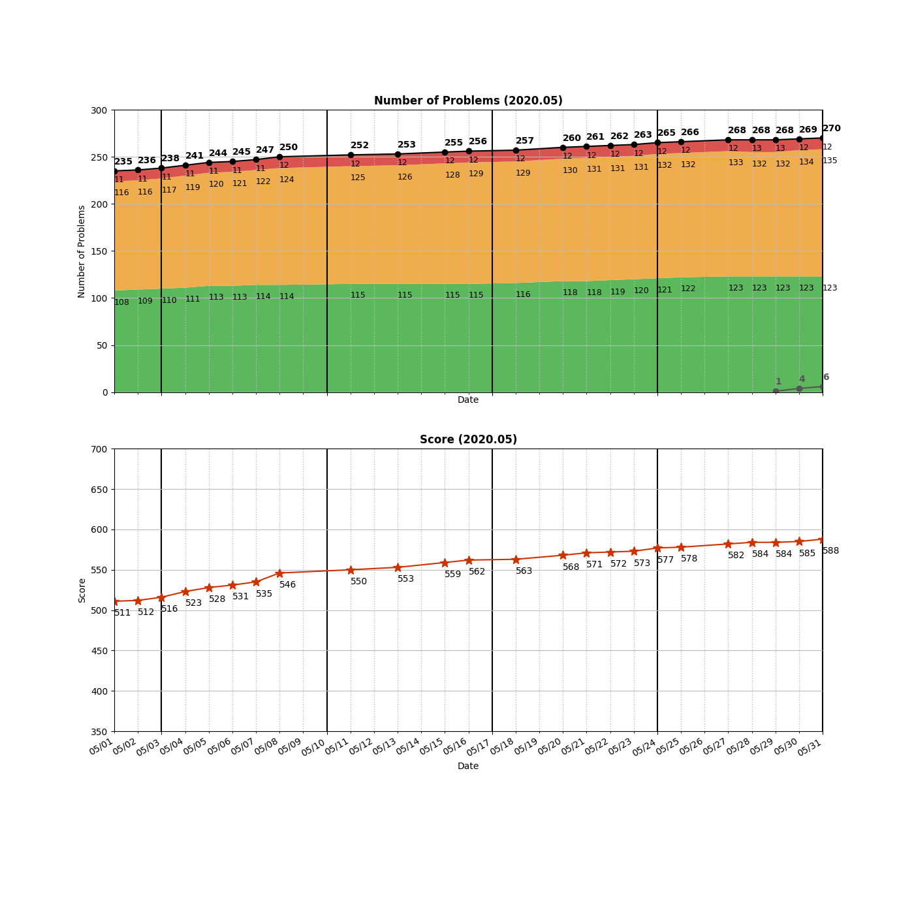

```
algo
├── _0005_LongestPalindromicSubstring.py
├── _0125_ValidPalindrome.py
├── array
│   ├── _0001_TwoSum.py
│   ├── _0004_MedianOfTwoSortedArrays.py
│   ├── _0018_4Sum.py
│   ├── _0027_RemoveElement.py
│   ├── _0031_NextPermutation.py
│   ├── _0036_ValidSudoku.py
│   ├── _0054_SpiralMatrix.py
│   ├── _0056_MergeIntervals.py
│   ├── _0073_SetMatrixZeroes.py
│   ├── _0088_MergeSortedArray.py
│   ├── _0121_BestTimeToBuyAndSellStock.py
│   ├── _0122_BestTimeToBuyAndSellStock2.py
│   ├── _0134_GasStation.py
│   ├── _0167_TwoSum2-InputArrayIsSorted.py
│   ├── _0169_MajorityElement.py
│   ├── _0189_RotateArray.py
│   ├── _0238_ProductOfArrayExceptSelf.py
│   ├── _0252_MeetingRooms.py
│   ├── _0253_MeetingRooms2.py
│   ├── _0283_MoveZeroes.py
│   ├── _0348_DesignTic-Tac-Toe.py
│   ├── _0349_IntersectionOfTwoArrays.py
│   ├── _0350_IntersectionOfTwoArrays2.py
│   ├── _0442_FindAllDuplicatesInAnArray.py
│   ├── _0448_FindAllNumbersDisappearedInAnArray.py
│   ├── _0463_IslandPerimeter.py
│   ├── _0485_MaxConsecutiveOnes.py
│   ├── _0523_ContinuousSubarraySum.py
│   ├── _0561_ArrayPartition1.py
│   ├── _0566_ReshapeTheMatrix.py
│   ├── _0581_ShortestUnsortedContinuousSubarray.py
│   ├── _0674_LongestContinuousIncreasingSubsequence.py
│   ├── _0844_BackspaceStringCompare.py
│   ├── _0845_LongestMountainInArray.py
│   ├── _0867_TransposeMatrix.py
│   ├── _0896_MonotonicArray.py
│   ├── _0905_SortArrayByParity.py
│   ├── _0994_RottingOranges.py
│   ├── _1002_FindCommonCharacters.py
│   └── _1243_ArrayTransformation.py
├── bfs
│   ├── _0102_BinaryTreeLevelOrderTraversal.py
│   ├── _0103_BinaryTreeZigzagLevelOrderTraversal.py
│   ├── _0107_BinaryTreeLevelOrderTraversal2.py
│   ├── _0127_WordLadder.py
│   ├── _0133_CloneGraph.py
│   ├── _0199_BinaryTreeRightSideView.py
│   ├── _0200_NumberOfIslands.py
│   ├── _0207_CourseSchedule.py
│   ├── _0210_CourseSchedule2.py
│   ├── _0490_TheMaze.py
│   ├── _0694_NumberOfDistinctIslands.py
│   ├── _0695_MaxAreaOfIsland.py
│   ├── _0909_SnakesAndLadders.py
│   └── _1197_MinimumKnightMoves.py
├── binary-search
│   ├── _0033_SearchInRotatedSortedArray.py
│   ├── _0034_FindFirstAndLastPositionOfElementInSortedArray.py
│   ├── _0035_SearchInsertPosition.py
│   ├── _0069_Sqrt.py
│   ├── _0074_SearchA2DMatrix.py
│   ├── _0081_SearchInRotatedSortedArray2.py
│   ├── _0153_FindMinimumInRotatedSortedArray.py
│   ├── _0162_FindPeakElement.py
│   ├── _0222_CountCompleteTreeNodes.py
│   ├── _0240_SearchA2DMatrix2.py
│   ├── _0278_FirstBadVersion.py
│   ├── _0300_LongestIncreasingSubsequence.py
│   ├── _0354_RussianDollEnvelopes.py
│   ├── _0367_ValidPerfectSquare.py
│   ├── _0658_FindKClosestElements.py
│   ├── _0704_BinarySearch.py
│   ├── _0852_PeakIndexInAMountainArray.py
│   ├── _0981_TimeBasedKey-ValueStore.py
│   └── _1300_SumOfMutatedArrayClosestToTarget.py
├── bits
│   └── _0268_MissingNumber.py
├── data-structure
│   ├── _0346_MovingAverageFromDataStream.py
│   ├── _0362_DesignHitCounter.py
│   └── _0846_HandOfStraights.py
├── dfs
│   ├── _0017_LetterCombinationsOfAPhoneNumber.py
│   ├── _0022_GenerateParentheses.py
│   ├── _0037_SudokuSolver.py
│   ├── _0039_CombinationSum.py
│   ├── _0040_CombinationSum2.py
│   ├── _0046_Permutations.py
│   ├── _0047_Permutations2.py
│   ├── _0051_N-Queens.py
│   ├── _0077_Combinations.py
│   ├── _0078_Subsets.py
│   ├── _0079_WordSearch.py
│   ├── _0089_GrayCode.py
│   ├── _0090_Subsets2.py
│   ├── _0131_PalindromePartitioning.py
│   ├── _0216_CombinationSum3.py
│   ├── _0291_WordPattern2.py
│   ├── _0401_BinaryWatch.py
│   ├── _0491_IncreasingSubsequences.py
│   ├── _0494_TargetSum.py
│   ├── _0526_BeautifulArrangement.py
│   ├── _0690_EmployeeImportance.py
│   ├── _0784_LetterCasePermutation.py
│   ├── _0841_KeysAndRooms.py
│   ├── _1079_LetterTilePossibilities.py
│   └── _1391_CheckIfThereIsAValidPathInAGrid.py
├── dp
│   ├── _0010_RegularExpressionMatching.py
│   ├── _0044_WildcardMatching.py
│   ├── _0053_MaximumSubarray.py
│   ├── _0055_JumpGame.py
│   ├── _0062_UniquePaths.py
│   ├── _0063_UniquePaths2.py
│   ├── _0064_MinimumPathSum.py
│   ├── _0096_UniqueBinarySearchTrees.py
│   ├── _0120_Triangle.py
│   ├── _0139_WordBreak.py
│   ├── _0152_MaximumProductSubarray.py
│   ├── _0198_HouseRobber.py
│   ├── _0213_HouseRobber2.py
│   ├── _0221_MaximalSquare.py
│   ├── _0256_PaintHouse.py
│   ├── _0279_PerfectSquares.py
│   ├── _0322_CoinChange.py
│   ├── _0338_CountingBits.py
│   ├── _0416_PartitionEqualSubsetSum.py
│   ├── _0576_OutOfBoundaryPaths.py
│   ├── _0647_PalindromicSubstrings.py
│   ├── _0688_KnightProbabilityInChessboard.py
│   ├── _0718_MaximumLengthOfRepeatedSubarray.py
│   ├── _0746_MinCostClimbingStairs.py
│   ├── _0877_StoneGame.py
│   ├── _0935_KnightDialer.py
│   └── _1048_LongestStringChain.py
├── hashmap
│   ├── _0049_GroupAnagrams.py
│   ├── _0146_LRUCache.py
│   ├── _0217_ContainsDuplicate.py
│   ├── _0219_ContainsDuplicate2.py
│   ├── _0242_ValidAnagram.py
│   ├── _0347_TopKFrequentElements.py
│   ├── _0359_LoggerRateLimiter.py
│   ├── _0380_InsertDeleteGetRandomO(1).py
│   ├── _0387_FirstUniqueCharacterInAString.py
│   ├── _0409_LongestPalindrome.py
│   ├── _0525_ContiguousArray.py
│   ├── _0535_EncodeAndDecodeTinyURL.py
│   ├── _0560_SubarraySumEqualsK.py
│   ├── _0657_RobotReturnToOrigin.py
│   ├── _0692_TopKFrequentWords.py
│   ├── _0705_DesignHashSet.py
│   ├── _0706_DesignHashMap.py
│   ├── _0771_JewelsAndStones.py
│   ├── _0957_PrisonCellsAfterNDays.py
│   ├── _1086_HighFive.py
│   └── _1207_UniqueNumberOfOccurrences.py
├── heap
│   ├── _0215_KthLargestElementInAnArray.py
│   ├── _0239_SlidingWindowMaximum.py
│   ├── _0264_UglyNumber2.py
│   ├── _0313_SuperUglyNumber.py
│   ├── _0378_KthSmallestElementInASortedMatrix.py
│   ├── _0703_KthLargestElementInAStream.py
│   ├── _0973_KClosestPointsToOrigin.py
│   └── _1046_LastStoneWeight.py
├── linkedlist
│   ├── _0002_AddTwoNumbers.py
│   ├── _0019_RemoveNthNodeFromEndOfList.py
│   ├── _0021_MergeTwoSortedLists.py
│   ├── _0023_MergeKSortedLists.py
│   ├── _0024_SwapNodesInPairs.py
│   ├── _0061_RotateList.py
│   ├── _0141_LinkedListCycle.py
│   ├── _0142_LinkedListCycle2.py
│   ├── _0147_InsertionSortList.py
│   ├── _0160_IntersectionOfTwoLinkedLists.py
│   ├── _0203_RemoveLinkedListElements.py
│   ├── _0206_ReverseLinkedList.py
│   ├── _0234_PalindromeLinkedList.py
│   ├── _0237_DeleteNodeInALinkedList.py
│   └── _0876_MiddleOfTheLinkedList.py
├── math
│   ├── _0009_PalindromeNumber.py
│   ├── _0202_HappyNumber.py
│   ├── _0263_UglyNumber.py
│   └── _0914_XOfAKindInADeckOfCards.py
├── matrix
│   └── _0048_RotateImage.py
├── recursion
│   ├── _0050_Pow(x,n).py
│   ├── _0060_PermutationSequence.py
│   ├── _0070_ClimbingStairs.py
│   ├── _0118_PascalsTriangle.py
│   ├── _0119_PascalsTriangle2.py
│   ├── _0344_ReverseString.py
│   ├── _0509_FibonacciNumber.py
│   └── _0700_SearchInABinarySearchTree.py
├── sliding-window
│   └── _0076_MinimumWindowSubstring.py
├── sorting
│   ├── _0075_SortColors.py
│   └── _0912_SortAnArray.py
├── stack-queue
│   ├── _0020_ValidParentheses.py
│   ├── _0155_MinStack.py
│   ├── _0225_ImplementStackUsingQueues.py
│   ├── _0232_ImplementQueueUsingStacks.py
│   ├── _0716_MaxStack.py
│   └── _0946_ValidateStackSequences.py
├── string
│   ├── _0003_LongestSubstringWithoutRepeatingCharacters.py
│   ├── _0014_LongestCommonPrefix.py
│   ├── _0038_CountAndSay.py
│   ├── _0171_ExcelSheetColumnNumber.py
│   ├── _0290_WordPattern.py
│   ├── _0299_BullsAndCows.py
│   ├── _0383_RansomNote.py
│   ├── _0412_FizzBuzz.py
│   ├── _0415_AddStrings.py
│   ├── _0459_RepeatedSubstringPattern.py
│   ├── _0680_ValidPalindrome2.py
│   ├── _0819_MostCommonWord.py
│   └── _1427_PerformStringShifts.py
├── tree
│   ├── _0094_BinaryTreeInorderTraversal.py
│   ├── _0098_ValidateBinarySearchTree.py
│   ├── _0100_SameTree.py
│   ├── _0101_SymmetricTree.py
│   ├── _0104_MaximumDepthOfBinaryTree.py
│   ├── _0105_ConstructBinaryTreeFromPreorderAndInorderTraversal.py
│   ├── _0108_ConvertSortedArrayToBinarySearchTree.py
│   ├── _0110_BalancedBinaryTree.py
│   ├── _0111_MinimumDepthOfBinaryTree.py
│   ├── _0112_PathSum.py
│   ├── _0113_PathSum2.py
│   ├── _0114_FlattenBinaryTreeToLinkedList.py
│   ├── _0129_SumRootToLeafNumbers.py
│   ├── _0144_BinaryTreePreorderTraversal.py
│   ├── _0173_BinarySearchTreeIterator.py
│   ├── _0208_ImplementTrie(PrefixTree).py
│   ├── _0226_InvertBinaryTree.py
│   ├── _0230_KthSmallestElementInBST.py
│   ├── _0236_LowestCommonAncestorOfABinaryTree.py
│   ├── _0257_BinaryTreePaths.py
│   ├── _0270_ClosestBinarySearchTreeValue.py
│   ├── _0297_SerializeAndDeserializeBinaryTree.py
│   ├── _0429_N-aryTreeLevelOrderTraversal.py
│   ├── _0538_ConvertBSTtoGreaterTree.py
│   ├── _0543_DiameterOfBinaryTree.py
│   ├── _0572_SubtreeOfAnotherTree.py
│   ├── _0617_MergeTwoBinaryTrees.py
│   ├── _0653_TwoSum4.py
│   ├── _0654_MaximumBinaryTree.py
│   ├── _0669_TrimABinarySearchTree.py
│   ├── _0701_InsertIntoABinarySearchTree.py
│   ├── _0783_MinimumDistanceBetweenBSTNodes.py
│   ├── _0938_RangeSumOfBST.py
│   ├── _1022_SumOfRootToLeafBinaryNumbers.py
│   └── _1214_TwoSumBSTs.py
├── two-pointer
│   ├── _0011_ContainerWithMostWater.py
│   ├── _0015_3Sum.py
│   ├── _0016_3SumClosest.py
│   ├── _0026_RemoveDuplicatesFromSortedArray.py
│   ├── _0170_TwoSum3_DataStructureDesign.py
│   ├── _0209_MinimumSizeSubarraySum.py
│   ├── _0392_IsSubsequence.py
│   ├── _0487_MaxConsecutiveOnes2.py
│   ├── _0977_SquaresOfASortedArray.py
│   ├── _1099_TwoSumLessThanK.py
│   └── _1358_NumberOfSubstringsContainingAllThreeCharacters.py
├── union-find
│   ├── _0547_FriendCircles.py
│   └── _305_NumberOfIslands2.py
├── warmup
│   └── fibonacci.py
└── wip
    ├── _0127_WordLadder.py
    └── wordladder.py

22 directories, 261 files

=====================================
============= Local Repo ============
=====================================
_0001_TwoSum.py
_0002_AddTwoNumbers.py
_0003_LongestSubstringWithoutRepeatingCharacters.py
_0004_MedianOfTwoSortedArrays.py
_0005_LongestPalindromicSubstring.py
_0009_PalindromeNumber.py
_0010_RegularExpressionMatching.py
_0011_ContainerWithMostWater.py
_0014_LongestCommonPrefix.py
_0015_3Sum.py
_0016_3SumClosest.py
_0017_LetterCombinationsOfAPhoneNumber.py
_0018_4Sum.py
_0019_RemoveNthNodeFromEndOfList.py
_0020_ValidParentheses.py
_0021_MergeTwoSortedLists.py
_0022_GenerateParentheses.py
_0023_MergeKSortedLists.py
_0024_SwapNodesInPairs.py
_0026_RemoveDuplicatesFromSortedArray.py
_0027_RemoveElement.py
_0031_NextPermutation.py
_0033_SearchInRotatedSortedArray.py
_0034_FindFirstAndLastPositionOfElementInSortedArray.py
_0035_SearchInsertPosition.py
_0036_ValidSudoku.py
_0037_SudokuSolver.py
_0038_CountAndSay.py
_0039_CombinationSum.py
_0040_CombinationSum2.py
_0044_WildcardMatching.py
_0046_Permutations.py
_0047_Permutations2.py
_0048_RotateImage.py
_0049_GroupAnagrams.py
_0050_Pow(x,n).py
_0051_N-Queens.py
_0053_MaximumSubarray.py
_0054_SpiralMatrix.py
_0055_JumpGame.py
_0056_MergeIntervals.py
_0060_PermutationSequence.py
_0061_RotateList.py
_0062_UniquePaths.py
_0063_UniquePaths2.py
_0064_MinimumPathSum.py
_0069_Sqrt.py
_0070_ClimbingStairs.py
_0073_SetMatrixZeroes.py
_0074_SearchA2DMatrix.py
_0075_SortColors.py
_0076_MinimumWindowSubstring.py
_0077_Combinations.py
_0078_Subsets.py
_0079_WordSearch.py
_0081_SearchInRotatedSortedArray2.py
_0088_MergeSortedArray.py
_0089_GrayCode.py
_0090_Subsets2.py
_0094_BinaryTreeInorderTraversal.py
_0096_UniqueBinarySearchTrees.py
_0098_ValidateBinarySearchTree.py
_0100_SameTree.py
_0101_SymmetricTree.py
_0102_BinaryTreeLevelOrderTraversal.py
_0103_BinaryTreeZigzagLevelOrderTraversal.py
_0104_MaximumDepthOfBinaryTree.py
_0105_ConstructBinaryTreeFromPreorderAndInorderTraversal.py
_0107_BinaryTreeLevelOrderTraversal2.py
_0108_ConvertSortedArrayToBinarySearchTree.py
_0110_BalancedBinaryTree.py
_0111_MinimumDepthOfBinaryTree.py
_0112_PathSum.py
_0113_PathSum2.py
_0114_FlattenBinaryTreeToLinkedList.py
_0118_PascalsTriangle.py
_0119_PascalsTriangle2.py
_0120_Triangle.py
_0121_BestTimeToBuyAndSellStock.py
_0122_BestTimeToBuyAndSellStock2.py
_0125_ValidPalindrome.py
_0127_WordLadder.py
_0127_WordLadder.py
_0129_SumRootToLeafNumbers.py
_0131_PalindromePartitioning.py
_0133_CloneGraph.py
_0134_GasStation.py
_0139_WordBreak.py
_0141_LinkedListCycle.py
_0142_LinkedListCycle2.py
_0144_BinaryTreePreorderTraversal.py
_0146_LRUCache.py
_0147_InsertionSortList.py
_0152_MaximumProductSubarray.py
_0153_FindMinimumInRotatedSortedArray.py
_0155_MinStack.py
_0160_IntersectionOfTwoLinkedLists.py
_0162_FindPeakElement.py
_0167_TwoSum2-InputArrayIsSorted.py
_0169_MajorityElement.py
_0170_TwoSum3_DataStructureDesign.py
_0171_ExcelSheetColumnNumber.py
_0173_BinarySearchTreeIterator.py
_0189_RotateArray.py
_0198_HouseRobber.py
_0199_BinaryTreeRightSideView.py
_0200_NumberOfIslands.py
_0202_HappyNumber.py
_0203_RemoveLinkedListElements.py
_0206_ReverseLinkedList.py
_0207_CourseSchedule.py
_0208_ImplementTrie(PrefixTree).py
_0209_MinimumSizeSubarraySum.py
_0210_CourseSchedule2.py
_0213_HouseRobber2.py
_0215_KthLargestElementInAnArray.py
_0216_CombinationSum3.py
_0217_ContainsDuplicate.py
_0219_ContainsDuplicate2.py
_0221_MaximalSquare.py
_0222_CountCompleteTreeNodes.py
_0225_ImplementStackUsingQueues.py
_0226_InvertBinaryTree.py
_0230_KthSmallestElementInBST.py
_0232_ImplementQueueUsingStacks.py
_0234_PalindromeLinkedList.py
_0236_LowestCommonAncestorOfABinaryTree.py
_0237_DeleteNodeInALinkedList.py
_0238_ProductOfArrayExceptSelf.py
_0239_SlidingWindowMaximum.py
_0240_SearchA2DMatrix2.py
_0242_ValidAnagram.py
_0252_MeetingRooms.py
_0253_MeetingRooms2.py
_0256_PaintHouse.py
_0257_BinaryTreePaths.py
_0263_UglyNumber.py
_0264_UglyNumber2.py
_0268_MissingNumber.py
_0270_ClosestBinarySearchTreeValue.py
_0278_FirstBadVersion.py
_0279_PerfectSquares.py
_0283_MoveZeroes.py
_0290_WordPattern.py
_0291_WordPattern2.py
_0297_SerializeAndDeserializeBinaryTree.py
_0299_BullsAndCows.py
_0300_LongestIncreasingSubsequence.py
_0313_SuperUglyNumber.py
_0322_CoinChange.py
_0338_CountingBits.py
_0344_ReverseString.py
_0346_MovingAverageFromDataStream.py
_0347_TopKFrequentElements.py
_0348_DesignTic-Tac-Toe.py
_0349_IntersectionOfTwoArrays.py
_0350_IntersectionOfTwoArrays2.py
_0354_RussianDollEnvelopes.py
_0359_LoggerRateLimiter.py
_0362_DesignHitCounter.py
_0367_ValidPerfectSquare.py
_0378_KthSmallestElementInASortedMatrix.py
_0380_InsertDeleteGetRandomO(1).py
_0383_RansomNote.py
_0387_FirstUniqueCharacterInAString.py
_0392_IsSubsequence.py
_0401_BinaryWatch.py
_0409_LongestPalindrome.py
_0412_FizzBuzz.py
_0415_AddStrings.py
_0416_PartitionEqualSubsetSum.py
_0429_N-aryTreeLevelOrderTraversal.py
_0442_FindAllDuplicatesInAnArray.py
_0448_FindAllNumbersDisappearedInAnArray.py
_0459_RepeatedSubstringPattern.py
_0463_IslandPerimeter.py
_0485_MaxConsecutiveOnes.py
_0487_MaxConsecutiveOnes2.py
_0490_TheMaze.py
_0491_IncreasingSubsequences.py
_0494_TargetSum.py
_0509_FibonacciNumber.py
_0523_ContinuousSubarraySum.py
_0525_ContiguousArray.py
_0526_BeautifulArrangement.py
_0535_EncodeAndDecodeTinyURL.py
_0538_ConvertBSTtoGreaterTree.py
_0543_DiameterOfBinaryTree.py
_0547_FriendCircles.py
_0560_SubarraySumEqualsK.py
_0561_ArrayPartition1.py
_0566_ReshapeTheMatrix.py
_0572_SubtreeOfAnotherTree.py
_0576_OutOfBoundaryPaths.py
_0581_ShortestUnsortedContinuousSubarray.py
_0617_MergeTwoBinaryTrees.py
_0647_PalindromicSubstrings.py
_0653_TwoSum4.py
_0654_MaximumBinaryTree.py
_0657_RobotReturnToOrigin.py
_0658_FindKClosestElements.py
_0669_TrimABinarySearchTree.py
_0674_LongestContinuousIncreasingSubsequence.py
_0680_ValidPalindrome2.py
_0688_KnightProbabilityInChessboard.py
_0690_EmployeeImportance.py
_0692_TopKFrequentWords.py
_0694_NumberOfDistinctIslands.py
_0695_MaxAreaOfIsland.py
_0700_SearchInABinarySearchTree.py
_0701_InsertIntoABinarySearchTree.py
_0703_KthLargestElementInAStream.py
_0704_BinarySearch.py
_0705_DesignHashSet.py
_0706_DesignHashMap.py
_0716_MaxStack.py
_0718_MaximumLengthOfRepeatedSubarray.py
_0746_MinCostClimbingStairs.py
_0771_JewelsAndStones.py
_0783_MinimumDistanceBetweenBSTNodes.py
_0784_LetterCasePermutation.py
_0819_MostCommonWord.py
_0841_KeysAndRooms.py
_0844_BackspaceStringCompare.py
_0845_LongestMountainInArray.py
_0846_HandOfStraights.py
_0852_PeakIndexInAMountainArray.py
_0867_TransposeMatrix.py
_0876_MiddleOfTheLinkedList.py
_0877_StoneGame.py
_0896_MonotonicArray.py
_0905_SortArrayByParity.py
_0909_SnakesAndLadders.py
_0912_SortAnArray.py
_0914_XOfAKindInADeckOfCards.py
_0935_KnightDialer.py
_0938_RangeSumOfBST.py
_0946_ValidateStackSequences.py
_0957_PrisonCellsAfterNDays.py
_0973_KClosestPointsToOrigin.py
_0977_SquaresOfASortedArray.py
_0981_TimeBasedKey-ValueStore.py
_0994_RottingOranges.py
_1002_FindCommonCharacters.py
_1022_SumOfRootToLeafBinaryNumbers.py
_1046_LastStoneWeight.py
_1048_LongestStringChain.py
_1079_LetterTilePossibilities.py
_1086_HighFive.py
_1099_TwoSumLessThanK.py
_1197_MinimumKnightMoves.py
_1207_UniqueNumberOfOccurrences.py
_1214_TwoSumBSTs.py
_1243_ArrayTransformation.py
_1300_SumOfMutatedArrayClosestToTarget.py
_1358_NumberOfSubstringsContainingAllThreeCharacters.py
_1391_CheckIfThereIsAValidPathInAGrid.py
_1427_PerformStringShifts.py
_305_NumberOfIslands2.py
=====================================
Num of Python Practice:  259


=====================================
============= Leetcode ==============
=====================================
 0001 Two Sum
 0002 Add Two Numbers
 0003 Longest Substring Without Repeating Characters
 0004 Median of Two Sorted Arrays
 0005 Longest Palindromic Substring
 0009 Palindrome Number
 0010 Regular Expression Matching
 0011 Container With Most Water
 0014 Longest Common Prefix
 0015 3Sum
 0016 3Sum Closest
 0017 Letter Combinations of a Phone Number
 0018 4Sum
 0019 Remove Nth Node From End of List
 0020 Valid Parentheses
 0021 Merge Two Sorted Lists
 0022 Generate Parentheses
 0023 Merge k Sorted Lists
 0024 Swap Nodes in Pairs
 0026 Remove Duplicates from Sorted Array
 0027 Remove Element
 0031 Next Permutation
 0033 Search in Rotated Sorted Array
 0034 Find First and Last Position of Element in Sorted Array
 0035 Search Insert Position
 0036 Valid Sudoku
 0037 Sudoku Solver
 0038 Count and Say
 0039 Combination Sum
 0040 Combination Sum II
 0044 Wildcard Matching
 0046 Permutations
 0047 Permutations II
 0048 Rotate Image
 0049 Group Anagrams
 0050 Pow(x, n)
 0051 N-Queens
 0053 Maximum Subarray
 0054 Spiral Matrix
 0055 Jump Game
 0056 Merge Intervals
 0060 Permutation Sequence
 0061 Rotate List
 0062 Unique Paths
 0063 Unique Paths II
 0064 Minimum Path Sum
 0069 Sqrt(x)
 0070 Climbing Stairs
 0073 Set Matrix Zeroes
 0074 Search a 2D Matrix
 0075 Sort Colors
 0076 Minimum Window Substring
 0077 Combinations
 0078 Subsets
 0079 Word Search
 0081 Search in Rotated Sorted Array II
 0088 Merge Sorted Array
 0089 Gray Code
 0090 Subsets II
 0094 Binary Tree Inorder Traversal
 0096 Unique Binary Search Trees
 0098 Validate Binary Search Tree
 0100 Same Tree
 0101 Symmetric Tree
 0102 Binary Tree Level Order Traversal
 0103 Binary Tree Zigzag Level Order Traversal
 0104 Maximum Depth of Binary Tree
 0105 Construct Binary Tree from Preorder and Inorder Traversal
 0107 Binary Tree Level Order Traversal II
 0108 Convert Sorted Array to Binary Search Tree
 0110 Balanced Binary Tree
 0111 Minimum Depth of Binary Tree
 0112 Path Sum
 0113 Path Sum II
 0114 Flatten Binary Tree to Linked List
 0118 Pascal's Triangle
 0119 Pascal's Triangle II
 0120 Triangle
 0121 Best Time to Buy and Sell Stock
 0122 Best Time to Buy and Sell Stock II
 0125 Valid Palindrome
 0127 Word Ladder
 0129 Sum Root to Leaf Numbers
 0131 Palindrome Partitioning
 0133 Clone Graph
 0134 Gas Station
 0136 Single Number
 0139 Word Break
 0141 Linked List Cycle
 0142 Linked List Cycle II
 0144 Binary Tree Preorder Traversal
 0146 LRU Cache
 0147 Insertion Sort List
 0152 Maximum Product Subarray
 0153 Find Minimum in Rotated Sorted Array
 0155 Min Stack
 0160 Intersection of Two Linked Lists
 0162 Find Peak Element
 0167 Two Sum II - Input array is sorted
 0169 Majority Element
 0170 Two Sum III - Data structure design
 0171 Excel Sheet Column Number
 0173 Binary Search Tree Iterator
 0189 Rotate Array
 0198 House Robber
 0199 Binary Tree Right Side View
 0200 Number of Islands
 0202 Happy Number
 0203 Remove Linked List Elements
 0206 Reverse Linked List
 0207 Course Schedule
 0208 Implement Trie (Prefix Tree)
 0209 Minimum Size Subarray Sum
 0210 Course Schedule II
 0213 House Robber II
 0215 Kth Largest Element in an Array
 0216 Combination Sum III
 0217 Contains Duplicate
 0219 Contains Duplicate II
 0221 Maximal Square
 0222 Count Complete Tree Nodes
 0225 Implement Stack using Queues
 0226 Invert Binary Tree
 0230 Kth Smallest Element in a BST
 0232 Implement Queue using Stacks
 0234 Palindrome Linked List
 0236 Lowest Common Ancestor of a Binary Tree
 0237 Delete Node in a Linked List
 0238 Product of Array Except Self
 0239 Sliding Window Maximum
 0240 Search a 2D Matrix II
 0242 Valid Anagram
 0252 Meeting Rooms
 0253 Meeting Rooms II
 0256 Paint House
 0257 Binary Tree Paths
 0263 Ugly Number
 0264 Ugly Number II
 0268 Missing Number
 0270 Closest Binary Search Tree Value
 0278 First Bad Version
 0279 Perfect Squares
 0283 Move Zeroes
 0290 Word Pattern
 0291 Word Pattern II
 0297 Serialize and Deserialize Binary Tree
 0299 Bulls and Cows
 0300 Longest Increasing Subsequence
 0305 Number of Islands II
 0313 Super Ugly Number
 0322 Coin Change
 0338 Counting Bits
 0344 Reverse String
 0346 Moving Average from Data Stream
 0347 Top K Frequent Elements
 0348 Design Tic-Tac-Toe
 0349 Intersection of Two Arrays
 0350 Intersection of Two Arrays II
 0354 Russian Doll Envelopes
 0359 Logger Rate Limiter
 0362 Design Hit Counter
 0367 Valid Perfect Square
 0378 Kth Smallest Element in a Sorted Matrix
 0380 Insert Delete GetRandom O(1)
 0383 Ransom Note
 0387 First Unique Character in a String
 0392 Is Subsequence
 0401 Binary Watch
 0409 Longest Palindrome
 0412 Fizz Buzz
 0415 Add Strings
 0416 Partition Equal Subset Sum
 0429 N-ary Tree Level Order Traversal
 0442 Find All Duplicates in an Array
 0448 Find All Numbers Disappeared in an Array
 0459 Repeated Substring Pattern
 0463 Island Perimeter
 0485 Max Consecutive Ones
 0487 Max Consecutive Ones II
 0490 The Maze
 0491 Increasing Subsequences
 0494 Target Sum
 0509 Fibonacci Number
 0523 Continuous Subarray Sum
 0525 Contiguous Array
 0526 Beautiful Arrangement
 0535 Encode and Decode TinyURL
 0538 Convert BST to Greater Tree
 0543 Diameter of Binary Tree
 0547 Friend Circles
 0560 Subarray Sum Equals K
 0561 Array Partition I
 0566 Reshape the Matrix
 0572 Subtree of Another Tree
 0576 Out of Boundary Paths
 0581 Shortest Unsorted Continuous Subarray
 0595 Big Countries
 0617 Merge Two Binary Trees
 0620 Not Boring Movies
 0627 Swap Salary
 0647 Palindromic Substrings
 0653 Two Sum IV - Input is a BST
 0654 Maximum Binary Tree
 0657 Robot Return to Origin
 0658 Find K Closest Elements
 0669 Trim a Binary Search Tree
 0674 Longest Continuous Increasing Subsequence
 0680 Valid Palindrome II
 0688 Knight Probability in Chessboard
 0690 Employee Importance
 0692 Top K Frequent Words
 0694 Number of Distinct Islands
 0695 Max Area of Island
 0700 Search in a Binary Search Tree
 0701 Insert into a Binary Search Tree
 0703 Kth Largest Element in a Stream
 0704 Binary Search
 0705 Design HashSet
 0706 Design HashMap
 0716 Max Stack
 0718 Maximum Length of Repeated Subarray
 0746 Min Cost Climbing Stairs
 0771 Jewels and Stones
 0783 Minimum Distance Between BST Nodes
 0784 Letter Case Permutation
 0819 Most Common Word
 0841 Keys and Rooms
 0844 Backspace String Compare
 0845 Longest Mountain in Array
 0846 Hand of Straights
 0852 Peak Index in a Mountain Array
 0867 Transpose Matrix
 0876 Middle of the Linked List
 0877 Stone Game
 0896 Monotonic Array
 0905 Sort Array By Parity
 0909 Snakes and Ladders
 0912 Sort an Array
 0914 X of a Kind in a Deck of Cards
 0935 Knight Dialer
 0938 Range Sum of BST
 0946 Validate Stack Sequences
 0957 Prison Cells After N Days
 0973 K Closest Points to Origin
 0977 Squares of a Sorted Array
 0981 Time Based Key-Value Store
 0994 Rotting Oranges
 1002 Find Common Characters
 1022 Sum of Root To Leaf Binary Numbers
 1046 Last Stone Weight
 1048 Longest String Chain
 1079 Letter Tile Possibilities
 1086 High Five
 1099 Two Sum Less Than K
 1197 Minimum Knight Moves
 1207 Unique Number of Occurrences
 1214 Two Sum BSTs
 1243 Array Transformation
 1300 Sum of Mutated Array Closest to Target
 1358 Number of Substrings Containing All Three Characters
 1391 Check if There is a Valid Path in a Grid
 1426 Counting Elements
 1427 Perform String Shifts
=====================================
Solved / Total (Easy)  :  120 /  407
Solved / Total (Medium):  131 /  743
Solved / Total (Hard)  :   12 /  304
Solved / Total (All)   :  263 / 1454
Total Score            :  573
=====================================

```








