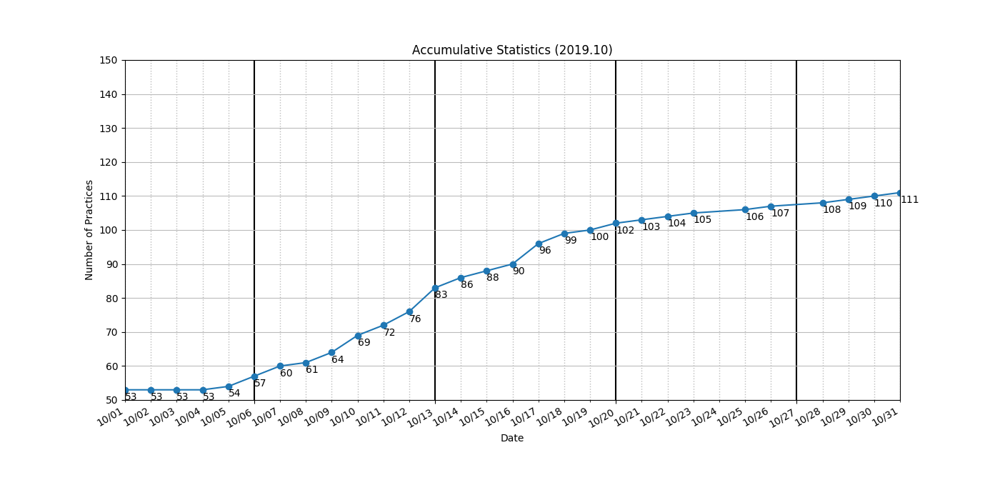

```
algo
├── _0005_LongestPalindromicSubstring.py
├── _0125_ValidPalindrome.py
├── _0409_LongestPalindrome.py
├── array
│   ├── _0001_TwoSum.py
│   ├── _0018_4Sum.py
│   ├── _0027_RemoveElement.py
│   ├── _0167_TwoSum2-InputArrayIsSorted.py
│   ├── _0169_MajorityElement.py
│   ├── _0189_RotateArray.py
│   ├── _0283_MoveZeroes.py
│   ├── _0349_IntersectionOfTwoArrays.py
│   ├── _0350_IntersectionOfTwoArrays2.py
│   ├── _0448_FindAllNumbersDisappearedInAnArray.py
│   ├── _0463_IslandPerimeter.py
│   ├── _0485_MaxConsecutiveOnes.py
│   ├── _0561_ArrayPartition1.py
│   ├── _0566_ReshapeTheMatrix.py
│   ├── _0674_LongestContinuousIncreasingSubsequence.py
│   ├── _0867_TransposeMatrix.py
│   ├── _0896_MonotonicArray.py
│   ├── _0905_SortArrayByParity.py
│   ├── _1002_FindCommonCharacters.py
│   └── _1243_ArrayTransformation.py
├── bfs
│   ├── _0102_BinaryTreeLevelOrderTraversal.py
│   ├── _0103_BinaryTreeZigzagLevelOrderTraversal.py
│   ├── _0107_BinaryTreeLevelOrderTraversal2.py
│   ├── _0133_CloneGraph.py
│   ├── _0199_BinaryTreeRightSideView.py
│   ├── _0207_CourseSchedule.py
│   └── _0210_CourseSchedule2.py
├── binary-search
│   ├── _0033_SearchInRotatedSortedArray.py
│   ├── _0034_FindFirstAndLastPositionOfElementInSortedArray.py
│   ├── _0035_SearchInsertPosition.py
│   ├── _0069_Sqrt.py
│   ├── _0074_SearchA2DMatrix.py
│   ├── _0081_SearchInRotatedSortedArray2.py
│   ├── _0153_FindMinimumInRotatedSortedArray.py
│   ├── _0162_FindPeakElement.py
│   ├── _0222_CountCompleteTreeNodes.py
│   ├── _0240_SearchA2DMatrix2.py
│   ├── _0278_FirstBadVersion.py
│   ├── _0300_LongestIncreasingSubsequence.py
│   ├── _0354_RussianDollEnvelopes.py
│   ├── _0367_ValidPerfectSquare.py
│   ├── _0658_FindKClosestElements.py
│   ├── _0704_BinarySearch.py
│   └── _0852_PeakIndexInAMountainArray.py
├── dfs
│   ├── _0017_LetterCombinationsOfAPhoneNumber.py
│   ├── _0022_GenerateParentheses.py
│   ├── _0037_SudokuSolver.py
│   ├── _0039_CombinationSum.py
│   ├── _0040_CombinationSum2.py
│   ├── _0046_Permutations.py
│   ├── _0047_Permutations2.py
│   ├── _0051_N-Queens.py
│   ├── _0077_Combinations.py
│   ├── _0078_Subsets.py
│   ├── _0089_GrayCode.py
│   ├── _0090_Subsets2.py
│   ├── _0131_PalindromePartitioning.py
│   ├── _0200_NumberOfIslands.py
│   ├── _0216_CombinationSum3.py
│   ├── _0401_BinaryWatch.py
│   ├── _0494_TargetSum.py
│   ├── _0526_BeautifulArrangement.py
│   ├── _0690_EmployeeImportance.py
│   ├── _0784_LetterCasePermutation.py
│   ├── _0841_KeysAndRooms.py
│   └── _1079_LetterTilePossibilities.py
├── dp
│   ├── _0053_MaximumSubarray.py
│   ├── _0096_UniqueBinarySearchTrees.py
│   ├── _0198_HouseRobber.py
│   ├── _0213_HouseRobber2.py
│   ├── _0322_CoinChange.py
│   ├── _0576_OutOfBoundaryPaths.py
│   ├── _0746_MinCostClimbingStairs.py
│   └── _0877_StoneGame.py
├── hashmap
│   ├── _0049_GroupAnagrams.py
│   ├── _0146_LRUCache.py
│   ├── _0242_ValidAnagram.py
│   ├── _0380_InsertDeleteGetRandomO(1).py
│   ├── _0387_FirstUniqueCharacterInAString.py
│   └── _0705_DesignHashSet.py
├── heap
│   ├── _0215_KthLargestElementInAnArray.py
│   ├── _0264_UglyNumber2.py
│   ├── _0703_KthLargestElementInAStream.py
│   ├── _0973_KClosestPointsToOrigin.py
│   └── _1046_LastStoneWeight.py
├── linkedlist
│   ├── _0002_AddTwoNumbers.py
│   ├── _0019_RemoveNthNodeFromEndOfList.py
│   ├── _0021_MergeTwoSortedLists.py
│   ├── _0023_MergeKSortedLists.py
│   ├── _0024_SwapNodesInPairs.py
│   ├── _0061_RotateList.py
│   ├── _0141_LinkedListCycle.py
│   ├── _0142_LinkedListCycle2.py
│   ├── _0160_IntersectionOfTwoLinkedLists.py
│   ├── _0203_RemoveLinkedListElements.py
│   └── _0206_ReverseLinkedList.py
├── math
│   └── _0263_UglyNumber.py
├── recursion
│   ├── _0050_Pow(x,n).py
│   ├── _0070_ClimbingStairs.py
│   ├── _0118_PascalsTriangle.py
│   ├── _0119_PascalsTriangle2.py
│   ├── _0344_ReverseString.py
│   ├── _0509_FibonacciNumber.py
│   └── _0700_SearchInABinarySearchTree.py
├── sorting
│   ├── _0075_SortColors.py
│   └── _0912_SortAnArray.py
├── stack-queue
│   ├── _0225_ImplementStackUsingQueues.py
│   └── _0232_ImplementQueueUsingStacks.py
├── string
│   ├── _0003_LongestSubstringWithoutRepeatingCharacters.py
│   ├── _0038_CountAndSay.py
│   └── _0383_RansomNote.py
├── tree
│   ├── _0094_BinaryTreeInorderTraversal.py
│   ├── _0098_ValidateBinarySearchTree.py
│   ├── _0100_SameTree.py
│   ├── _0101_SymmetricTree.py
│   ├── _0104_MaximumDepthOfBinaryTree.py
│   ├── _0108_ConvertSortedArrayToBinarySearchTree.py
│   ├── _0110_BalancedBinaryTree.py
│   ├── _0111_MinimumDepthOfBinaryTree.py
│   ├── _0112_PathSum.py
│   ├── _0113_PathSum2.py
│   ├── _0114_FlattenBinaryTreeToLinkedList.py
│   ├── _0129_SumRootToLeafNumbers.py
│   ├── _0144_BinaryTreePreorderTraversal.py
│   ├── _0173_BinarySearchTreeIterator.py
│   ├── _0226_InvertBinaryTree.py
│   ├── _0230_KthSmallestElementInBST.py
│   ├── _0236_LowestCommonAncestorOfABinaryTree.py
│   ├── _0257_BinaryTreePaths.py
│   ├── _0297_SerializeAndDeserializeBinaryTree.py
│   ├── _0429_N-aryTreeLevelOrderTraversal.py
│   ├── _0538_ConvertBSTtoGreaterTree.py
│   ├── _0572_SubtreeOfAnotherTree.py
│   ├── _0617_MergeTwoBinaryTrees.py
│   ├── _0653_TwoSum4.py
│   ├── _0654_MaximumBinaryTree.py
│   ├── _0669_TrimABinarySearchTree.py
│   ├── _0701_InsertIntoABinarySearchTree.py
│   ├── _0783_MinimumDistanceBetweenBSTNodes.py
│   ├── _0938_RangeSumOfBST.py
│   ├── _1022_SumOfRootToLeafBinaryNumbers.py
│   └── _1214_TwoSumBSTs.py
├── two-pointer
│   ├── _0015_3Sum.py
│   ├── _0016_3SumClosest.py
│   ├── _0026_RemoveDuplicatesFromSortedArray.py
│   ├── _0170_TwoSum3_DataStructureDesign.py
│   ├── _0209_MinimumSizeSubarraySum.py
│   ├── _0392_IsSubsequence.py
│   ├── _0977_SquaresOfASortedArray.py
│   └── _1099_TwoSumLessThanK.py
├── warmup
│   └── fibonacci.py
└── wip
    ├── _0127_WordLadder.py
    └── wordladder.py

17 directories, 156 files
=====================================
_0001_TwoSum.py
_0002_AddTwoNumbers.py
_0003_LongestSubstringWithoutRepeatingCharacters.py
_0005_LongestPalindromicSubstring.py
_0015_3Sum.py
_0016_3SumClosest.py
_0017_LetterCombinationsOfAPhoneNumber.py
_0018_4Sum.py
_0019_RemoveNthNodeFromEndOfList.py
_0021_MergeTwoSortedLists.py
_0022_GenerateParentheses.py
_0023_MergeKSortedLists.py
_0024_SwapNodesInPairs.py
_0026_RemoveDuplicatesFromSortedArray.py
_0027_RemoveElement.py
_0033_SearchInRotatedSortedArray.py
_0034_FindFirstAndLastPositionOfElementInSortedArray.py
_0035_SearchInsertPosition.py
_0037_SudokuSolver.py
_0038_CountAndSay.py
_0039_CombinationSum.py
_0040_CombinationSum2.py
_0046_Permutations.py
_0047_Permutations2.py
_0049_GroupAnagrams.py
_0050_Pow(x,n).py
_0051_N-Queens.py
_0053_MaximumSubarray.py
_0061_RotateList.py
_0069_Sqrt.py
_0070_ClimbingStairs.py
_0074_SearchA2DMatrix.py
_0075_SortColors.py
_0077_Combinations.py
_0078_Subsets.py
_0081_SearchInRotatedSortedArray2.py
_0089_GrayCode.py
_0090_Subsets2.py
_0094_BinaryTreeInorderTraversal.py
_0096_UniqueBinarySearchTrees.py
_0098_ValidateBinarySearchTree.py
_0100_SameTree.py
_0101_SymmetricTree.py
_0102_BinaryTreeLevelOrderTraversal.py
_0103_BinaryTreeZigzagLevelOrderTraversal.py
_0104_MaximumDepthOfBinaryTree.py
_0107_BinaryTreeLevelOrderTraversal2.py
_0108_ConvertSortedArrayToBinarySearchTree.py
_0110_BalancedBinaryTree.py
_0111_MinimumDepthOfBinaryTree.py
_0112_PathSum.py
_0113_PathSum2.py
_0114_FlattenBinaryTreeToLinkedList.py
_0118_PascalsTriangle.py
_0119_PascalsTriangle2.py
_0125_ValidPalindrome.py
_0127_WordLadder.py
_0129_SumRootToLeafNumbers.py
_0131_PalindromePartitioning.py
_0133_CloneGraph.py
_0141_LinkedListCycle.py
_0142_LinkedListCycle2.py
_0144_BinaryTreePreorderTraversal.py
_0146_LRUCache.py
_0153_FindMinimumInRotatedSortedArray.py
_0160_IntersectionOfTwoLinkedLists.py
_0162_FindPeakElement.py
_0167_TwoSum2-InputArrayIsSorted.py
_0169_MajorityElement.py
_0170_TwoSum3_DataStructureDesign.py
_0173_BinarySearchTreeIterator.py
_0189_RotateArray.py
_0198_HouseRobber.py
_0199_BinaryTreeRightSideView.py
_0200_NumberOfIslands.py
_0203_RemoveLinkedListElements.py
_0206_ReverseLinkedList.py
_0207_CourseSchedule.py
_0209_MinimumSizeSubarraySum.py
_0210_CourseSchedule2.py
_0213_HouseRobber2.py
_0215_KthLargestElementInAnArray.py
_0216_CombinationSum3.py
_0222_CountCompleteTreeNodes.py
_0225_ImplementStackUsingQueues.py
_0226_InvertBinaryTree.py
_0230_KthSmallestElementInBST.py
_0232_ImplementQueueUsingStacks.py
_0236_LowestCommonAncestorOfABinaryTree.py
_0240_SearchA2DMatrix2.py
_0242_ValidAnagram.py
_0257_BinaryTreePaths.py
_0263_UglyNumber.py
_0264_UglyNumber2.py
_0278_FirstBadVersion.py
_0283_MoveZeroes.py
_0297_SerializeAndDeserializeBinaryTree.py
_0300_LongestIncreasingSubsequence.py
_0322_CoinChange.py
_0344_ReverseString.py
_0349_IntersectionOfTwoArrays.py
_0350_IntersectionOfTwoArrays2.py
_0354_RussianDollEnvelopes.py
_0367_ValidPerfectSquare.py
_0380_InsertDeleteGetRandomO(1).py
_0383_RansomNote.py
_0387_FirstUniqueCharacterInAString.py
_0392_IsSubsequence.py
_0401_BinaryWatch.py
_0409_LongestPalindrome.py
_0429_N-aryTreeLevelOrderTraversal.py
_0448_FindAllNumbersDisappearedInAnArray.py
_0463_IslandPerimeter.py
_0485_MaxConsecutiveOnes.py
_0494_TargetSum.py
_0509_FibonacciNumber.py
_0526_BeautifulArrangement.py
_0538_ConvertBSTtoGreaterTree.py
_0561_ArrayPartition1.py
_0566_ReshapeTheMatrix.py
_0572_SubtreeOfAnotherTree.py
_0576_OutOfBoundaryPaths.py
_0617_MergeTwoBinaryTrees.py
_0653_TwoSum4.py
_0654_MaximumBinaryTree.py
_0658_FindKClosestElements.py
_0669_TrimABinarySearchTree.py
_0674_LongestContinuousIncreasingSubsequence.py
_0690_EmployeeImportance.py
_0700_SearchInABinarySearchTree.py
_0701_InsertIntoABinarySearchTree.py
_0703_KthLargestElementInAStream.py
_0704_BinarySearch.py
_0705_DesignHashSet.py
_0746_MinCostClimbingStairs.py
_0783_MinimumDistanceBetweenBSTNodes.py
_0784_LetterCasePermutation.py
_0841_KeysAndRooms.py
_0852_PeakIndexInAMountainArray.py
_0867_TransposeMatrix.py
_0877_StoneGame.py
_0896_MonotonicArray.py
_0905_SortArrayByParity.py
_0912_SortAnArray.py
_0938_RangeSumOfBST.py
_0973_KClosestPointsToOrigin.py
_0977_SquaresOfASortedArray.py
_1002_FindCommonCharacters.py
_1022_SumOfRootToLeafBinaryNumbers.py
_1046_LastStoneWeight.py
_1079_LetterTilePossibilities.py
_1099_TwoSumLessThanK.py
_1214_TwoSumBSTs.py
_1243_ArrayTransformation.py
=====================================
Num of Python Practice:  154
```



